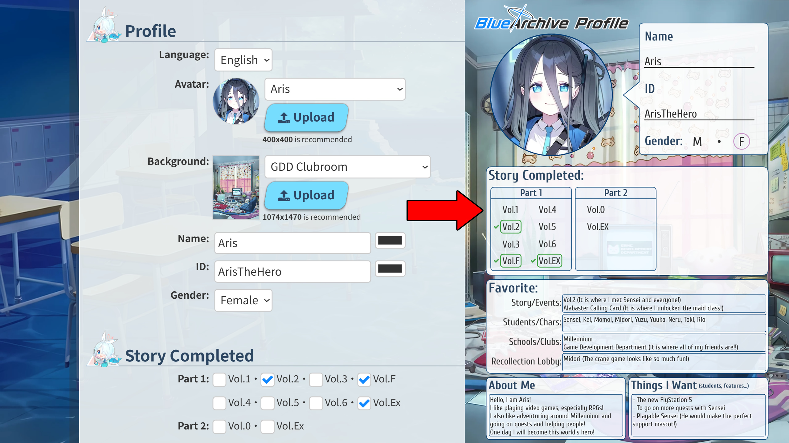

# Blue Archive Profile Generator
Blue Archive Profile Generator is a website that lets you create your own personal Blue Archive profile card that you can share with others on X via the [#BlueArchiveProfile](https://x.com/search?q=%23BlueArchiveProfile&src=typed_query&f=live) or [#ブルアカプロフィール](https://x.com/search?q=%23%E3%83%96%E3%83%AB%E3%82%A2%E3%82%AB%E3%83%97%E3%83%AD%E3%83%95%E3%82%A3%E3%83%BC%E3%83%AB&src=typed_query&f=live) hashtags. You're also free to share your card on other social media services! It's a way to meet other fans of the series by sharing your progress, your favorite characters, and more. You can give it a try online via the following link!

**https://sethclydesdale.github.io/ba-profile-generator/**


### Demo


<p align="center">
  
</p>

-----

**Quick Links**
- [Profile Templates](#profile-templates)
- [Contributing](#contributing)
- [Special Thanks](#special-thanks)


## Profile Templates 
This website was created to help make the process of filling out the image template easier, since not everyone has access to image editing software. However, if you'd like to add your own personal flair, feel free to download the templates via the following link.

[**Download Template Package**](https://sethclydesdale.github.io/ba-profile-generator/shittim-chest/template/BA%20Profile%20Templates.zip)

This package contains both English and Japanese templates. You can edit the provided images in [Krita](https://krita.org/en/), Photoshop, [GIMP](https://www.gimp.org/), or any other image editing software. If you're looking for premade backgrounds to use with the templates, you can find them [**here**](shittim-chest/template/bg/).

<p align="center">
  
</p>


## Contributing
You are more than welcome to contribute to this project if you'd like to! Here are some ways that you can contribute:

- [Contributing Avatars/Backgrounds](contributing-avatars-backgrounds)
- [Contributing A Translation](contributing-a-translation)

Aside from these methods of contribution, we also accept code and feature implementations, bug fixes, and more!


### Contributing Avatars/Backgrounds

There is a few rules for image contributions:

- Any imagery contributed for use in the templates must be official (i.e. from Blue Archive). We do not accept non-official artwork.
- Avatars must be **400x400** in WEBP or JPG format (All files will be converted to WEBP after contribution).
- Backgrounds must be **1074x1470** in WEBP or JPG format.
- Filenames should be lowercase with spaces replaced by a dash (-) or underscore (_).
- New options added in the `<select>` tags or groups should be in alphabetical order.

Now, here is the process for adding a new avatar or background:

1. [Fork](https://docs.github.com/en/pull-requests/collaborating-with-pull-requests/working-with-forks/fork-a-repo) this repository if you already haven't.
2. Navigate to your forked version of this repo to begin editing.
3. Add/Upload your avatar(s) to **shittim-chest\template\avatar** and your background(s) to **shittim-chest\template\bg**.
4. Go to the root and edit **index.html**.
5. Add your new Avatar/Background under the relevant `<select>` element using the `<option value="FILENAME" data-en="ENGLISH" data-ja="JAPANESE"></option>` tag.
6. Replace FILENAME with the name of your avatar/background file.
7. Replace ENGLISH with what this option should be called in English. If you don't know Japanese, simply replace JAPANESE with the value of the ENGLISH label.
8. Save the file.
9. When you're ready to submit your changes for review, open a [Pull Request](https://docs.github.com/en/pull-requests/collaborating-with-pull-requests/proposing-changes-to-your-work-with-pull-requests/about-pull-requests) in this repository.

If everything looks good, we will approve and merge your changes! Thank you!

<p align="center">
  
</p>


### Contributing A Translation
I only know English and Japanese, so I can only manage these translations of Blue Archive Profile Generator. If you would like to add support for a new language you're more than welcome to! The process is fairly straightforward:

1. [Fork](https://docs.github.com/en/pull-requests/collaborating-with-pull-requests/working-with-forks/fork-a-repo) this repository if you already haven't.
2. Navigate to your forked version of this repo to begin editing.
3. Go to the root and edit **index.html**.
4. Find `<select id="info-lang"` which is the dropdown we use for switching languages.
5. Add a new language using this tag: `<option value="LANG_CODE">LANG_NAME</option>`.
6. LANG_CODE should be a lowercase [language code](https://www.w3schools.com/tags/ref_language_codes.asp) relevant to the language you're adding.
7. LANG_NAME should be the name of the language in its native tongue (i.e., English, 日本語...).
8. After this you can add in text specific to your language using the `<span class="LANG_CODE">TEXT</span>` tag. LANG_CODE should be the code you added earlier in lowercase. TEXT should be the translation in that language.
9. You will see many `<span class="en">` and `<span class="ja">` tags. Simply place your translation at the end of this set of tags. For example: `<span class="en">...</span><span class="ja">...</span><span class="LANG_CODE">...</span>`. For `<option>` and `<optgroup>` tags, you will see `data-en="TEXT"`, `data-ja="TEXT"`, etc. You can add you translation for these tags by adding your language using the same method: `data-LANG_CODE="TEXT"`. LANG_CODE is again, the language code you selected earlier. Then inside the quotes, you put your translation where TEXT is.
10. When you're finished translating, make sure to save and contribute your changes.
11. Provide us a translation for the texts in [this template](https://sethclydesdale.github.io/ba-profile-generator/shittim-chest/template/en.png) or [download and edit the template file](https://drive.google.com/file/d/12Bp19muWGk8Qdt5l0GvTQS69XALdB0ZT/view?usp=sharing) and provide it to us in your PR.
12. Finally, when you're ready to submit your changes for review, open a [Pull Request](https://docs.github.com/en/pull-requests/collaborating-with-pull-requests/proposing-changes-to-your-work-with-pull-requests/about-pull-requests) in this repository.

If everything looks good, we will approve and merge your changes! Thank you!

**Advanced note:** For those testing offline, you must modify the CSS to hide the newly added language on other selections and then update the minified CSS file as well.

```css
.en, .ja, .LANG_CODE {
  visibility:hidden;
  position:fixed;
  height:0px;
  width:0px;
}

.en-lang .en, .ja-lang .ja, .LANG_CODE-lang .LANG_CODE {
  visibility:visible;
  position:static;
  height:auto;
  width:auto;
}
```

We handle this after PRs for those unfamilar with CSS.

<p align="center">
  
</p>


## Special Thanks
This project was made possible thanks to...
- [**Past Seth**](https://github.com/SethClydesdale/kiseki-profile-generator) for Kiseki Profile Generator which was used as a template for this project.
- [**Blue Archive Wiki**](https://bluearchive.wiki/wiki/Main_Page) for a majority of the avatars used in our templates.
- [**bluearchive-logo**](https://github.com/nulla2011/Bluearchive-logo) for our logo image.
- [**html2canvas**](https://github.com/niklasvh/html2canvas) for generating the Blue Archive Profile images.
- [**Font Awesome**](https://fontawesome.com/) for the awesome icons.
- [**Haise**](https://x.com/Roxas13thXIII) for providing feedback and giving me the idea to create this tool.
- [**Aris**](https://github.com/SethClydesdale/arisu-combo#arisu-combo) for being cute and cheering me on while I programmed.
- [**Nexon**](https://www.nexon.com/main/en) for Blue Archive, imagery, and audio files from the game that are used in this project.

<p align="center">
  
</p>
